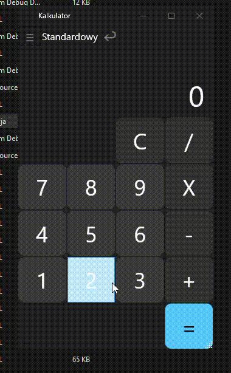

# Calculator App using WfF

# Solution projects hierarchy:

## Where:
- Calculator: Startup project responsible for managing individual implementations of calculators.
- Calculator.Persistance: Used for persistent history of calculations into local sqllite database.
- Calculator.Core: Lightway interface used to register implementations of calculator.
- Calculator.Standard: Implements default, standard calculator.

# How to add another calculator:
1. Create new, WPF library.
2. Reference "Calculator.Cre" project
3. Create view, class that implements `UserControl` and `ICalculatorWindow` interface.
4. Implement `ICalculatorWindow` interface, `Restore` method restores previously saved calculations, `Saved` event saves calculations.
5. Inside `App.xaml.cs` Register new calculator using extension method on `IServiceCollection`: `AddCalculator<T>(string name, string category, string icon, bool isDefault = false)` where generic argument is view.
   - Example: `services.AddCalculator<Calculator>("Standardowy", "Kalkulator", "🖩", true);`
